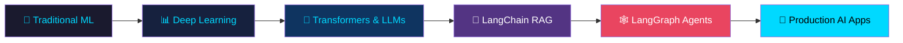

<div align="center">

<!-- Animated Typing Header -->


<!-- Profile Views Counter -->

&nbsp;

&nbsp;


</div>

---

## 🧠 About Me

```python
class ShivamGupta:
    def __init__(self):
        self.name         = "Shivam Gupta"
        self.username     = "shivam91264"
        self.education    = "B.S. Data Science & Applications @ IIT Madras ('26)"
        self.pronouns     = "he/him"
        self.location     = "India 🇮🇳"
        self.email        = "sg210590@gmail.com"

    @property
    def current_focus(self):
        return [
            "🤖 Machine Learning & Deep Learning",
            "🔗 LangChain & LangGraph (Agentic AI)",
            "🌐 Full-Stack Web Development",
            "📊 Data Analysis & Predictive Modeling",
        ]

    @property
    def open_to(self):
        return "Open-source collaboration in Python, ML, Data Analysis & LLMs"

    def say_hi(self):
        print("Thanks for visiting! Let's build something amazing together 🚀")

me = ShivamGupta()
me.say_hi()
```

---

## 🛠️ Tech Stack

### 🤖 AI / ML / Data Science


### 🔗 LLM / Agentic AI


### 🌐 Web Development


### 🗄️ Database & Tools


---

## 🌊 What I'm Currently Learning

<div align="center">

```
🔵 LangChain  ──────────────────────────────── Building RAG Pipelines
🔴 LangGraph  ──────────────────────────────── Agentic AI Workflows
🟠 Deep Learning ───────────────────────────── Neural Nets & Transformers
🟢 Full-Stack Dev ──────────────────────────── Vue + Flask Apps
```

</div>

---

## 📊 GitHub Stats

<div align="center">


<br/><br/>


<br/><br/>

<!-- Activity Graph -->


</div>

---

## 🏆 GitHub Trophies

<div align="center">


</div>

---

## 🚀 Featured Projects

<div align="center">

| Project | Description | Tech |
|:-------:|:-----------:|:----:|
| [🚗 MAD-2-Vehicle-Parking-App](https://github.com/shivam91264/MAD-2-VEHICLE-PARKING-APP) | Full-stack vehicle parking management system — IITM MAD-II Project | Vue.js, Flask, SQLite |
| [📊 Tourism Dataset Analysis](https://github.com/shivam91264/Tourism_Dataset_Data_Analysis) | Data analysis & visualization on tourism trends | Python, Pandas, Matplotlib |
| [🏨 Hotel Booking Data Analysis](https://github.com/shivam91264/Hotel_Booking_Data_Analysis) | EDA and predictive modeling on hotel bookings | Python, Scikit-Learn |
| [🤝 Influencer-Sponsor Coordination](https://github.com/shivam91264/Influencer-Engagement-Sponsor-Coordination-Flask-Project) | Web platform connecting influencers and sponsors | Flask, Python, MySQL |

</div>

---

## 🧩 LLM & Agentic AI Journey



---

## 🎯 2025 Goals

- [ ] 🤖 Build & deploy a production-ready **LangGraph Agent**
- [ ] 🔗 Complete advanced **LangChain RAG** projects
- [ ] 📚 Deep dive into **Transformers** from scratch
- [ ] 🌐 Launch a **Full-Stack AI-powered Web App**
- [ ] 📝 Publish articles on **Medium** about ML/AI
- [ ] ⭐ Reach **50 GitHub Stars** across repositories

---

## 📈 Contribution Snake

<div align="center">

<picture>
  <source media="(prefers-color-scheme: dark)" srcset="https://raw.githubusercontent.com/shivam91264/shivam91264/output/github-contribution-grid-snake-dark.svg">
  <source media="(prefers-color-scheme: light)" srcset="https://raw.githubusercontent.com/shivam91264/shivam91264/output/github-contribution-grid-snake.svg">
  
</picture>

> **Note:** To enable the snake animation, create a GitHub Action in your repo. Instructions below ↓

</div>

---

## 📬 Connect With Me

<div align="center">

[](mailto:sg210590@gmail.com)
[](https://linkedin.com/in/shivam91264)
[](https://twitter.com/shivam91264)
[](https://medium.com/@shivam91264)
[](https://github.com/shivam91264)

</div>

---

## 💡 Random Dev Quote

<div align="center">


</div>

---

## 🐍 Fun Fact

<div align="center">

```python
while True:
    eat()
    sleep()
    code()   # 🔥 This is the way
    repeat()
```

> *"The best way to predict the future is to build it."* — Alan Kay

</div>

---

<div align="center">

<!-- Footer wave -->


**⭐ Star my repos if you find them helpful! Every star motivates me to build more 🚀**

</div>

---

<!--
==============================================================
  HOW TO ENABLE CONTRIBUTION SNAKE ANIMATION
==============================================================
Create file: .github/workflows/snake.yml
Content:
  name: Generate Snake
  on:
    schedule:
      - cron: "0 0 * * *"
    workflow_dispatch:
  jobs:
    generate:
      runs-on: ubuntu-latest
      steps:
        - uses: Platane/snk@v3
          with:
            github_user_name: shivam91264
            outputs: |
              dist/github-contribution-grid-snake.svg
              dist/github-contribution-grid-snake-dark.svg?palette=github-dark
        - uses: crazy-max/ghaction-github-pages@v3.1.0
          with:
            target_branch: output
            build_dir: dist
          env:
            GITHUB_TOKEN: ${{ secrets.GITHUB_TOKEN }}
==============================================================
  HOW TO ENABLE PROFILE VIEWS COUNTER
==============================================================
The komarev.com badge already auto-counts. No setup needed!
Just make sure the username in the URL is correct: shivam91264

==============================================================
  EASY CUSTOMIZATION GUIDE
==============================================================
1. CHANGE TYPING TEXT: Edit the ?lines= parameter in the typing SVG URL
   - Separate each line with a + sign, use %7C for |, %26 for &
   
2. CHANGE THEME: Replace "tokyonight" with: dracula, radical, merko, gruvbox, etc.

3. ADD/REMOVE TECH BADGES: Copy any badge pattern and change the name/color/logo
   Format: 

4. UPDATE GOALS: Edit the checkboxes [ ] section. Change [ ] to [x] when done!

5. UPDATE PROJECTS TABLE: Add rows following the same | format |

6. CHANGE FOOTER COLOR: Edit customColorList=6,11,20 to any combo 0-27
==============================================================
-->
